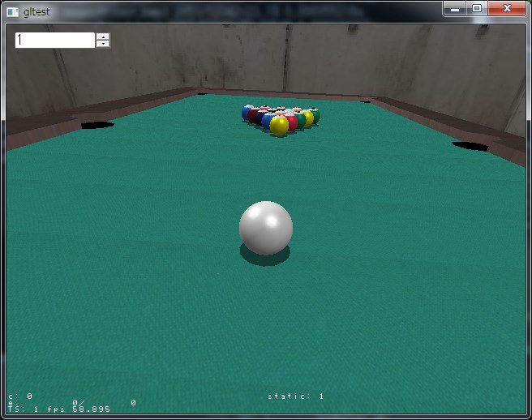
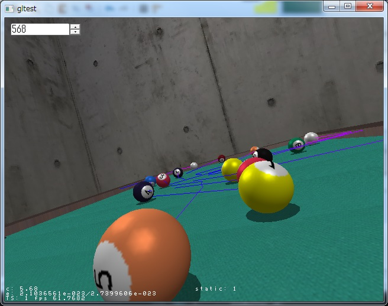
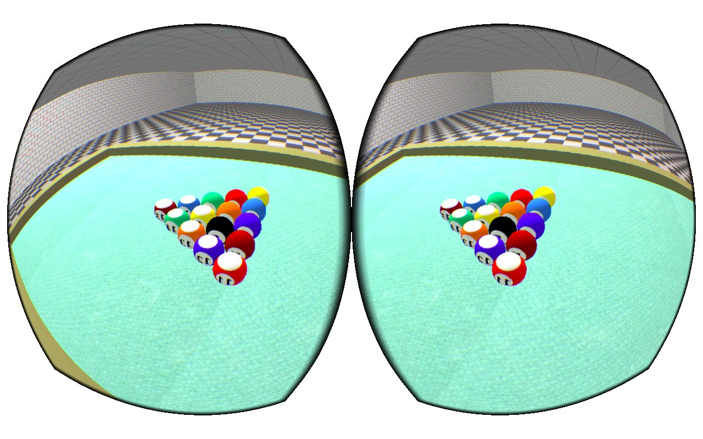

OculusBilliard
=============

Billiard Game for Oculus Rift

Overview
--------

This project is a merge of two distinct projects -- OculusRoomTiny sample in Oculus SDK 0.4.0
and my personal billiard game project.
It does not include all the files in the SDK.
Place the working tree under Samples directory of the SDK so the references
to the resources in the SDK match those of OculusRoomTiny sample.

This repository consists of two projects:

* billiard, the original billard game which can be run without Oculus Rift.

* OculusBilliard, a ported version of billiard with Oculus Rift support.

Screenshots
-----------

### Billiard

### OculusBilliard

Controls
--------

### Billiard

Holding and releasing mouse button stroke the cue.
You can change impact point on the ball by moving mouse pointer
while holding down the mouse button.

### OculusBilliard

Not yet implemented

* 'W', 'A', 'S' and 'D' - Walk to directions

* ESC - End the game

Build
-----

It's confirmed to build with Visual Studio 2012.
It uses a tiny amount of C++11 features, so older versions of Visual Studio
or other compilers may fail to build.

Also, I have only tested the program with Direct3D11.  I'm not sure if the
program runs with OpenGL.

Oculus Rift SDK for Windows can be downloaded from here:

https://developer.oculusvr.com/?action=dl

Running Environment
-------------------

It's only tested on Windows 7 with Oculus Rift DK1.
I have neither tested Linux or Mac OS.

As for DK2, it's not delivered to me yet.
